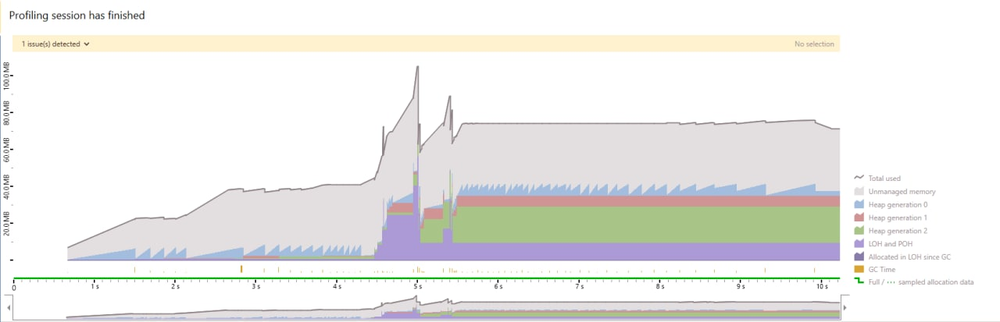
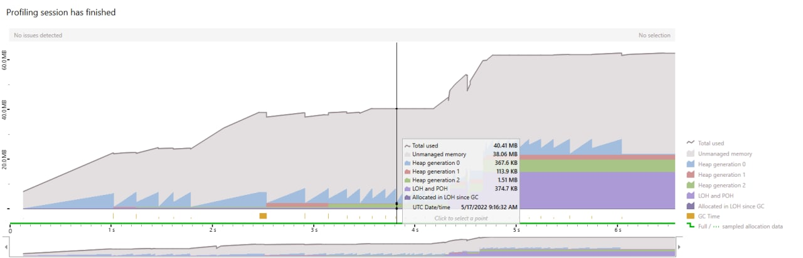
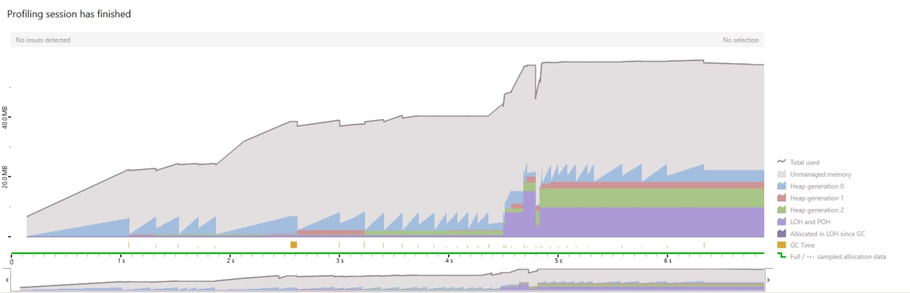
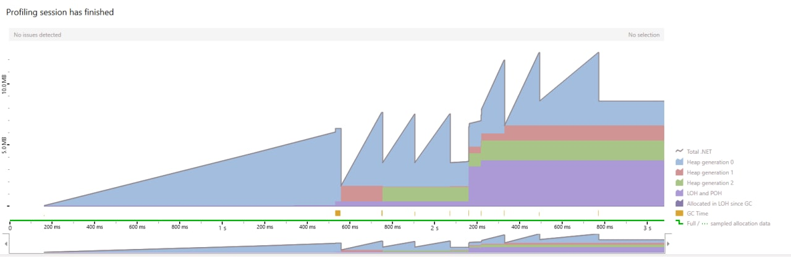
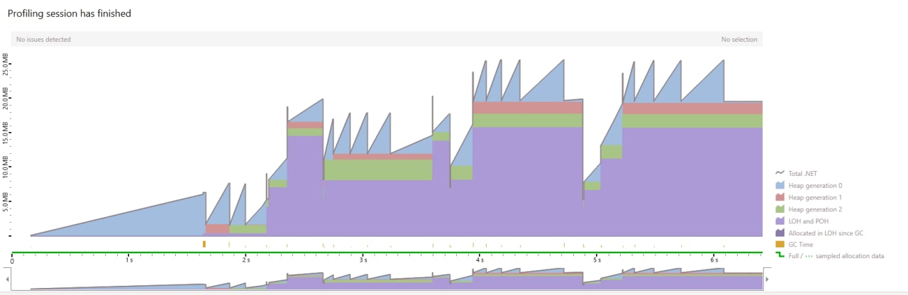
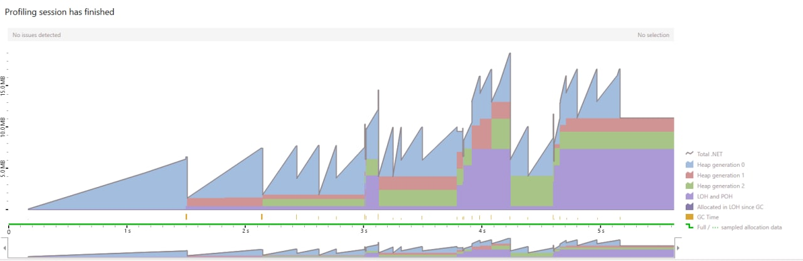

# PerfTips

# Проблемы

1. Разное API для сокетов на net6.0 и net7.0
2. То что поддерживается на винде, не поддерживается на маке
3. Нет способа получить N байт

## Задание

> Реализовать функционал распределённой файловой системы.
 
> Для корректной работы нужно реализовать два вида запускаемых приложений: основной сервер и ноды.
> Ноды должны уметь обрабатывазать запросы от основного сервера. 
> Основной сервер должен обрабатывать описанные выше команды. 
> Формат общения между сервером и нодой остаются на усмотрение автора (здесь имеется в виду то, что будет использоваться во взаимодейтсвии поверх TCP: протоколы/спецификации/др.).

## Теормин

### TCP

**EndPoint** - конечная точка, то место, куда можно подключаться. У одного сервера может быть несколько эндпоинтв.
К ним можно подключаться по разным адресам.

> По факту это просто server:port, который на который отправляются какие-то данные по tcp или который биндится на получение данных

**Socket** - это "дверь", в которую можно заходяить - то, через что устанавливается соединение.

> Для Tcp пртокола мы используем следующие настройки сокета:
> AddressFamily.InterNetwork (IPv4 версия),
> SocketType.Stream (стандартный тип передачи данных для Tcp)
> ProtocolType.Tcp (протокол передачи данных)

Для того, чтобы сделать несколько клиентов прослушивания, нужно запускать их всех на одном и том же Ip, но с разными портами

**Listener** - сокет для подключения и обрабатывания конкретного клиента. Создаётся под каждого клиента.

### Реализация

- **Сервер** - приложение, запускаемое на каком-то IP, которое бесконечно _(условно)_ обрабатывает команды от пользователя
- **Нода** - приложение, запускаемое на каком-то IP, которое бесконечно _(условно)_ обрабатывает команды от сервера

В качестве обёртки над работой с Tcp, как было указазано ранее, выбран Socket (**зря**)

### Сценарий использования со стороны сервера

- Сервер запускается и ждёт команд от пользователя (посредством dataProvider - через консоль, через файл или как угодно иначе)
- После получения команды сервер мапит полученную команду из инпут формата в `IServerCommand` и вызывает у неё метод `.Execute`
  - В данный метод передаётся: 
    - инстанс сервера для получения нужной информации
    - менеджер пакетов для более адекватной работы с отправкой байтов посредством предоставленного АПИ
    - датаПровайдерБ для получения необходимых данных для выполнения команды и абстрагирования от одного источника данных (например, консоли)
    - токенСурс для отмены операций С КАЙФОМ
- Каждый экземпляр класса, имплементирующий `IServerCommand`, внутри себя содержит всю обособленную логику выполнения своего действия
  - Обязанности `IServerCommand`:
    - Получить необходимые для выполнения команды аргументы (название файла, имя ноды, пути и т.д)
    - Получить необходимые для выполнения команды дынные (взять байтики файла, найти ноду у сервера и т.д)
    - Принять/отправить запрос от/на какой-то айпишник, на котором будет слушать нода
      - Тут подразумевается создание сокета (соединения с каким-то IP) и отправка пакета на этот IP  
    - Сформировать результат выполнения после обработки полученных данных
    - Закрыть соединение(ия) с нодой (нодами), которое(ые) было(и) открыто(ы) в рамках выполнения команды
- Завершить выполнение команды и перейти к ожиданию ввода следующей команды от пользователя

### Сценарий использования со стороны ноды

- Нода запускается на каком-то IP и биндится на прослушивание данных, поступающих на данный IP по Tcp
- Когда сервер отправляет что-то на IP, на котором прослушивает нода, на ноде создаётся Socket (listener), который в дальнейшем будет использоваться как 
абстракция над `NetworkStream` (могу ошибаться в формулировке)
- После получения данных нода получает байты полученного поката с помощью packageManager и десериализует полученное сообщение
- Внутри сообщения, которое было отправлено с сервера, лежет `NodeCommand` _(Enum)_, который мапится в `INodeCommand` и вызывает у неё метод `.Execute`
  - В данный метод передаётся:
    - инстанс ноды для получения нужной информации
    - менеджер пакетов для более адекватной работы с байтами посредством предоставленного АПИ
    - сокет (лисенер) для приёма и передачи данных между сервером и нодой
    - токенСурс - для отмены операций С КАЙФОМ
- Каждый экземпляр класса, имплементирующий `INodeCommand`, внутри себя содержит всю обособленную логику выполнения своего действия
    - Обязанности `IServerCommand`:
        - Получить необходимые для выполнения команды дынные (какие байтики засунуть по какому пути и т.д)
        - Принять/отправить запрос от/на обратно на сервер
            - Тут подразумевается создание вызов метода Send, SendAsync, SendFile, SendFileAsync, BeginSend, BeginSendAsync, EndSend, EndSendAsync, BeginSendFile, BeginSendFileAsync, EndSendFile, EndSendFileAsync, а также не забытые к упоминанию: Receive, ReceiveAsync, BeginReceive, ReceiveAsync, EndReceive, EndReceiveAsync и всевозможные их перегрузки [^1]
        - Завершить выполнение команды и перейти к ожиданию следующей команды от сервера (я забил на отправку респонс кодов, потому что они энивей падает)

[^1]:  да, у меня сгорело с миллиарда мeтодов для отправки/приёма байтов и практически нулёвой документацией по их использованию

## Оптимизации

Для улучшения перфоманса я реализовал следующие методы по борьбе с ~~коррупцией~~ аллокациями:

1. `ArrayPool` - расшаренное пространство массивов, аллоцированных в рантайме и возможно уже неиспользуемых. Позволяет не аллоцировать память под новые массивы, а взять уже аллоцированные, но уже не используемые и не успевшие умереть после прохода GC
2. `class` -> `readonly record struct` - структура является противоположником классу, так как является `value type` **ОБЫЧНО!!!!!** хранится на стеке, в отличие от класса, который является `ref type` и **ОБЫЧНО (хз может можно как-то байтолюбством засунуть его на стек, но я сомневаюсь)** хранится в куче.
Это позволяет уменьшить количество аллокаций, засчэт выделения памяти на стеке (краткосрочной и быстрой памяти) вместо кучи (долгосрочной и более медленной).
3. `List(capasity: value)` - ещё одна оптимизация, позволяющая явно указать капасити **(НЕ РАЗМЕР)** листа, который будет создаваться. Позволяет избегать перевыделения непрерывной области памяти под новый массив и перезаписи всего массива.
4. `string` - в заполнения файлов данными заменил `string.Concat` на `stringBuilder.Append` - такая себе оптимизация, учитывая что она вообще не относится к алгоритму, но тем не менее свой импакт она внесла
5. Попытался в оптимизацию сериализатора - поигрался с разными сериализаторами, но ощутимой разницы по памяти не увидел
6. Попытался в оптимизацию алгоритмов - хотел изменить алгоритмы на более легковесные, но при любом пуке всё падало и переставало работать

### dotMemory and other...

Ну очев у меня всё 20 раз переломалось пока я пытался делать какие-то трейсинги и трекать перфоманс работы моего приложения, поэтому за их достоверность ничего не могу сказать.

Тем не менее, если пытаться провести какой-то бейслайн между первым и последним бенчмарком, можно заметить:

1. Общее количество аллоцируемой памяти (согласно dotMemory) уменьширось примерно в 2-3 раза

#### 5к файлов

*Первый дамп с 5к файлами без оптимизаций*

*Второй дамп с 5к файлами и заменой некоторых листов на ArrayPool*

*Третий дамп с 5к файлов, заменой некоторых листов на ArrayPool и основных классов на readonly record struct*

Как можно заметить, количество всей памяти снизилось примерно в 2 раза, при этом колитство объектов, хранящихся в LOH и SOH относительно Generation 2 выросло _(наверное это плохо)_

#### 1к файлов

*Первый дамп после _каких-то_ оптимизаций*

*Второй дамп после _каких-то_ оптимизаций и замены string.Concat на stringBuilder*

Тут мы видим незначитеьное уменьшение аллоцированной памяти (но не факт что оно связано с добавлением стрингбилдера)

### Несколько балансировок нод

*Первый дамп с несколькими запусками балансировок без оптимизаций*

*Второй дамп с несколькими запусками балансировок после _всех_ оптимизаций*

Можно заметить, что, как и было сказано ранее, общее количество памяти (согласно dotTrace) уменьшилось примерно в два раза, а также значительно уменьшился размер SOH и LOH (наверное, это хорошо)