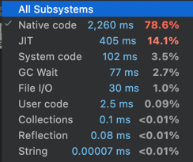
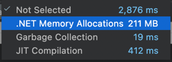
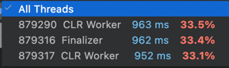
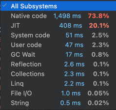
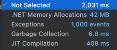
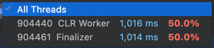

# Профилинг бекапов

## Задание

> Используя инструменты dotTrace, dotMemory, всё-что-угодно-хоть-windbg, проанализировать работу написанного кода для бекапов.
> Необходимо написать сценарий, когда в цикле будет выполняться много запусков, будут создаваться и удаляться точки.
> Проверить два сценария: с реальной работой с файловой системой и без неё.
> В отчёте неоходимо проанализировать полученные результаты, сделать вывод о написанном коде.

## Теормин

### Профилинг

**Профилинг** - исследование каких-либо параметров системы/программы во время её работы, визуализация и анализ результатов.

### Типы профилинга

`Sampling` - останавливаем треды, снимаем с них текущие колстеки и записываем их _(неравномерно)_.

`Tracing` - перед тем как скомпилировать функцию, профайлер API вызывает профайлер и тогда профайлер АПИ внутри CLR вставляет вставы, которые вызывают колбеки этих функций на старте и на выходе.
По колбекам мы считаем времена.

`Line-by-line` - помогает выяснить, как ведёт себя функция.

`Timeline` - динамический анализ данных (в отличие от предыдущих, статических). Отображается активность потока во времени.

## Решение

### Файловая система

> *устный анализ*

### Не файловая система

> *устный анализ*
