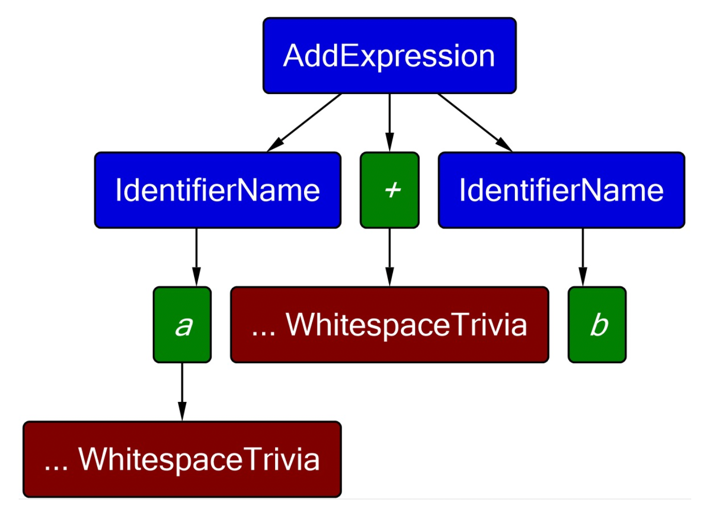
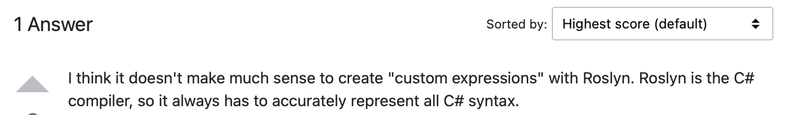

# Codegen

> Я устал переводить английскую документацию на русский, поэтому часть терминов будет описана на английском

## Задание

> 1. Написать HTTP-сервер, которые предоставляет несколько методов (в качестве примера, можно взять 2-3 лабораторные второго подпотока). Рекомендуемый язык - Java ввиду простоты поднятия и прочего. Можно использовать любой другой (лучше заранее согласовать). Примеры необходимого функционала:
     1. GET, POST запросы
     2. Запросы с аргументами в Query, в Body
     3. Сложные модели с Response (не примитивы, хотя бы классы с полями)
     4. Аргументы, которые являются коллекциями, респонсы, которые коллекции содержат
> 2. Написать упрощённый парсер (на C#) для этого сервера, чтобы можно было получить семантическую модель (можно использовать любые библиотеки для этого), а именно:
     1. Описание методов из API - url, список аргументов, возвращаемое значение
     2. Модели, которые используются в реквестах и респонсах
> 3. Используя Source Generator реализовать генерацию HTTP-клиента для данного сервера. Для API должны генерироваться все нужные модели, методы. Можно посмотреть на Swager codegen, примеры его работы и результат его генерации.

## Сайты и инструменты

1. <a href="https://roslynquoter.azurewebsites.net">**Roslyn Quoter**</a> - оч помогло
2. Библиотека **Microsoft.CodeAnalysis.CSharp** - оч не помогло
3. **Rossynt** _(plugin)_ - оч помогло
4. <a href="https://regex101.com">regex101</a> - если бы этого не было, я бы не сделал лабу

## Теормин

### Code syntax tree

**Code syntax tree**  - it is an immutable data structure representing the program as a tree of names, commands and marks

### Code syntax tree structure

- Syntax tokens (keyword, literals, etc.)
   - Syntax trivia (white space and comments)

- Syntax nodes (language constructs) - contains the actual code source structure



> Roslyn syntax tree is immutable

#### Syntax nodes

1. It represents such things as **`declarations`**, **`statements`**, **`clauses`** and **`expressions`**.

2. Each of categories is represented by a class from `Microsoft.CodeAnalysis.SyntaxNode`

3. They're always have parents (`.Parent`) and children's (`.ChildNodes()`) nodes

#### Syntax tokens

1. It represents **`language grammar`**.

2. It has no parent or tokens.

3. It consist of **`keywords`**, **`identifiers`**, **`literals`** and **`punctuation`**.

4. It stores object properties, which could be gain by evaluating `.Value` or `.ValueText` properties

#### Syntax trivia

1. It represents **`white spaces`**, **`comments`** and **`processor directives`**

#### Spans

1. Each node, token and trivia has its position within the source text and the number of characters it consists of.

## Парсинг джавы

### Вступление

> Отсутствие готовых инструментов для парсинга Java -> C# _(ввиду бессмысленности данной затеи по многим причинам)_,
> а также нежелание разбираться в непонятных инструментах, предоставляющих полу-меры по решению проблемы,
> я решил написать собственный **упрощённый** парсер с Java на C# в предметной области нашей лабораторной работы

### Логика работы

1. В любом языке с **Си-подобным** синтаксисом есть такое понятие как **зона видимости (`scope`)**,
   эти самые скоупы есть у каждого класса и каждого метода - именно поэтому я решил взять за основу парсера работу со скоупами.

2. Для начала мы парсим каждый файл джавы и получаем массив строк, после чего проверяем этот массив строк на то,
   сбалансированны ли скобки в данном файле (иначе последующая обработка, ввиду опоры на скоупы, будет бессмысленна).

3. Если скобки в файле сбалансированны, то мы приступаем к парсингу данного файла на скоупы. Есть несколько видов скоупов в рамках предметной области:
   - `ClassScope` - очевидно
   - `MethodScope` - очевидно
   - `InlineScope` - конструкции по типу _`@DeleteMapping("/{id}")`_
   - `InnerScope` - всё остальное, включая то, что находится внутри `MethodScope`

4. Скоупы парсятся исходя из их вложенности, то есть у нас получается какая-то такая структура: `ClassScope` -> `MethodScope` -> `InnerScope`,
   и на любом из этих этапов у нас также может заваляться `InlineScope`

5. После получения скоупов мы можем обрабатывать нужные части кода в соответствии с потребностями - это, так сказать, **_детали реализации_**

6. Если говорить о деталях реализации немного точнее, то основой для парсинга, **_`ЕСТЕСТВЕННО`_**, стали регулярки, так как по факту мы пытаемся запапить синтаксис одного языка в другой,
   и если мы не хотим писать синтаксические словари и мапить каждое слово языка N в слово языка M, учитывать различные возможности языков и всё такое, то регулярки являются очевидным выбором.

#### Регулярки

1. <a href="https://regex101.com/r/ORlSfH/1"> Метод джавы </a>
2. <a href="https://regex101.com/r/YLcV4V/2"> Пареметры метода </a>
3. <a href="https://regex101.com/r/EBUX3N/1"> Проперти джавы </a>

## Source Generation

### Структура синтаксического дерева в рамках лабы

- Compilation Unit
   - UsingDirectives
   - NameSpaceDeclaration
      - ClassDeclaration
         - MethodDeclaration

### Как работает

Как работает сурс генерация? Ну как работает, так и работает, что тут разговаривать-то.

1. Вызываем парсер и получаем из него наши классы, хранящие информацию о контроллерах и сущностях, на основе которых нужно сгенерить клиент
2. Создаём CompilationUnit
3. Создаём <Kind>NameSpaceSyntax
4. Создаём RecordDeclarationSyntax
5. Создаём MethodDeclarationSyntax
6. Суём RecordDeclarationSyntax и MethodDeclarationSyntax внутрь <Kind>NameSpaceSyntax, приправляем это UsingDirectiveSyntax
7. Суём что получилось на прошлом шаге в CompilationUnit и радуемся, если оно отработало

> Ах да, создание классов и методов

Надо упомянуть _(помянуть)_, что создание любых сущностей происходит через методы статического класса **SyntaxFactory**

Также, как оказалось _(путём проб и ошибок)_, ВСЕ структуры (и классы), которые создаются этой пректавной фабрикой, являются РИДОНЛИ.

Всё, что мы можем сделать - это юзать методы по типу `.With<FeatureName>` и переприсваивать токен, чтобы изменения сохранились.

> Всё-таки, создание класов и методов

Для создания классов я выбрал Record, тк там надо генерить меньше всего кода (одну строчку).

Для создания методов я выбрал не писать лабу, но потом, к сожалению, продолжил.

И классы, и методы я создавал через Rewriter класс, которому передавал токен в метод `Visit<SyntaxName>` **(что за паттерн)**,
и внутри него проходился по всем сущностям, вытягивая из них необходимую информацию для кодгена,
ну и, собственно говоря, делал этот самый кодген.

**Кстати, паттерн Visitor**

Самый кайф - это писать body у методов, которые превращаются в код на весь экран, если ты хочешь написать внутри тела метода хотя бы 2-3 строки)

> 

## Source Generation (инкрементальные изменения)

Я честно пытался сделать эту таску, но по причинам отсутствия JIT-дебаггера и миллиарда рандомных ошибок, падающих тут и там,
в основном связанных с ошибками сериализации и отсутствием тех или иных Assembly (что ОЧЕНЬ СТРАННО), я не смог довести её до рабочего состояния

### Идея реализации инкрементальных изменений

1. В начале работы сурсгена я осматриваю файл, в котором лежат структуры, сохранённые на прошлом запуске (это сериализованные `ControllerDeclaration` && `EntityDeclaration` или вытащенный хардкогод сурсген файл, который я паршу в дерево)
2. Далее я использую класс `ItemStateManager<T, TComparer>`, который с помощью `TCopmarer where TCopmarer : IEqualityComparer<T>` вытягивает все изменённые методы и/или дтошки в зависимости от дженерика
3. Обновление синтаксического дерева отличается в зависимости от выбранного подхода, поэтому опишу оба
   1. Если мы выбрали вытягивать дерево, то `ItemStateManager` должен вернуть нам новые ноды и ноды, которые были удалены, после чего
      добавляем новые ноды `MethodDeclarationSyntax` и удаляем старые.
      1. Была идея использовать `ReplaceNode` (очевидно), но в рамках лабы не совсем понятно,
         как именно понять, что нода изменилась. В целом можно сделать такой компарер, который будет смотреть, что если изменилось имя, но не изменилось ничего остального,
         то мы считаем, что это старая нода, но её нужно реплейснуть. Если изменились параметры, но не изменилось имя, то это старая нода, которую
         нужно реплейснуть и тд, но это очень сильные упрощения, поэтому проще пойти по первому варианту.
   2. Если мы выбрали вытягивать жсон (или другую структуру, в которую были сериализованы нашы классы), то в этом случае мы опять же получаем из `ItemStateManager`
      набор удалённых и набор обновлённых нод, после чего просто создаём нужные заново, а старые удаляем.

## Source Generation (генерация Swagger)

Я сгенерил клиент для моей лабы Reports с помощью `swagger-codegen`

```md
swagger-codegen generate -i /Users/lipa/Desktop/swagger.json -l csharp -o /Users/lipa/Desktop/swagger-SG
```

Получил пачку файлов и начал их анализировать.

В результате выполныния команды я получил:

1. Общий класс для отправки запросов к апи
2. Классы клиентов для каждого из контроллеров со всеми методами, которые внутри себя генерируют миллиард параметров, таких как боди запроса, всякие дополнительные данные,
   принимаемый формат, хедер и тд и тд - в зависимости от типа запроса и в зависомости от его настроек.
3. Каждый метод внутри каждого клиента контроллера после создания миллиарда параметров запихивал их в общий класс дял отправки запросов, который и выполнял сам запрос.
4. Помимо клиента там сгенерировались, естественно, дтошки
5. Также были сгенерированы тесты для моего клиента

После того, как я 2-3 недели сидел с сурс генератором, я смотрел на этот код и в моментах думал:
1. "АААААА, ТАК Я ТАК ЖЕ ДЕЛАЛ - СТАВИЛ ДЕФОЛТЫ ВЕЗДЕ ВМЕСТО НУЛОВ ЧТОБЫ НИЧЕГО НЕ ЛОМАЛОСЬ"
2. "ААААА, сделать общий метод для отправки запросов и пихсать в него 1231231 параметров - хорошо придумано, конечно, спасибо, что я так делать не буду"
3. "ААААА, у них там везде только объявление параметров без инициализации - явно они генерируют всё это по шаблону, а в моей апишке просто нету ныжных параметров, поэтому они не заполняются"

## Резюме

В общем, во время неписания этой лабы я прошёл 10 стадий принятия: от хуйта лабы, до любви и обратно к хейту, но в целом, не считая отсутствия JIT-дебаггера и невозможности закончить выполнение
лабы в полной мере, мне даж понравилось и я что-то смог понять.

Также у меня возник небольшой реторический вопрос: почему ни у кого со всего потока нет никаких вопросов, ни у кого ничего не ломается, всем всё понятно,
а я один такой дебил сижу и ничо не понимаю, и у меня всё ломается и ничо не работает, но это так, мысли вслух :)

По всем возникшим вопросам обращаться в <a href="t.me/dirty_lipa">тг</a>
